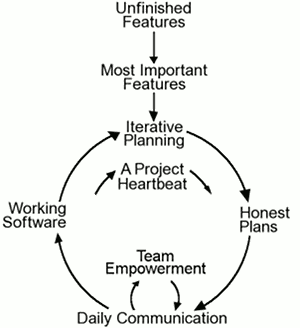
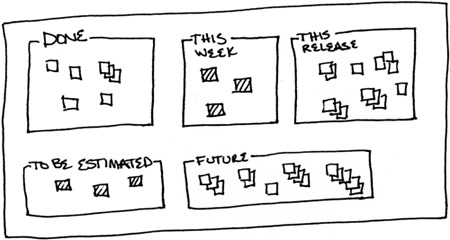
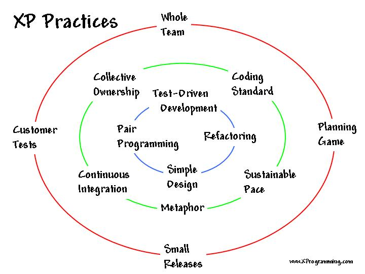
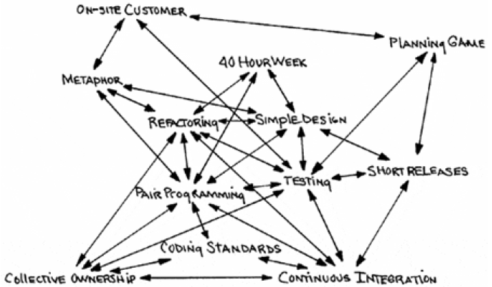

# eXtreme Programming

Ноябрь 2015

<!-- TODO
 - Вставить фотографии и картинки
   - "отцов"
   - парного программирования
 - Подумать, не стоит ли вернуть стратегии в тело лекции
 - Почитать про Whole Team
 - Почитать про первый проект в Crysler (вставить фотографию здания)
-->

# Содержание

  1. Основы
  2. Практики
  3. Внедрение

# История

  - Первый XP проект был запущен 6 Марта 1996.
  - В 1999 году опубликована книга Кента Бека _"Extreme Programming Explained:
    Embrace Change"_.
  - Авторы методологии: Кент Бек, Мартин Фаулер, Уорд Каннингем и другие.

# Место XP

> Экстремальное программирование — это __упрощенная__ методика организации
  производства для __небольших и средних по размеру__ команд специалистов,
  занимающихся разработкой программного продукта в условиях __неясных или быстро
  меняющихся__ требований.

Кент Бек

# Решаемые проблемы

  - Смещение графиков
  - Текучка кадров
  - Количество дефектов
  - Недостаток возможностей
  - Потеря полезности/актуальности

Любая из этих проблем может привести к закрытию проекта.

# Ценности ХР

  - Общение
  - Простота
  - Обратная cвязь
  - Смелость
  - Уважение

# Жизненный цикл

[http://www.extremeprogramming.org](http://www.extremeprogramming.org)

# War Room

# War Room

# Task Board

Обстановка должна быть информативной.

# Практики XP

# Практики XP

  1. __TDD__
  1. __Simple Design__
  1. __Refactoring__
  1. __Pair Programming__
  1. Metaphor
  1. Continuous Integration
  1. Collective Ownership
  1. Coding Standard
  1. Sustainable Pace
  1. Planning Game
  1. Small Releases
  1. Customer Tests
  1. Whole Team

# TDD

  - Весь код должен быть покрыт тестами
  - При обнаружении дефекта создается тест
  - Все тесты должны пройти, перед тем как код будет интегрирован
  - После интеграции запускаются приемочные тесты и результат публикуется

# Простой дизайн (_Simple Design_)

  - ["Do The Simplest Thing That Could Possibly Work"][dtsttcpw]
  - Добавляйте в дизайн то, что вам нужно,\
    _только тогда_, когда это _действительно нужно_!
  - Благодаря постоянной переработке кода вы легко вносите изменения в дизайн
    системы.
  - Простой дизайн _жизненно_ важен при дальнейшей модификации системы.

# Рефакторинг (_Refactoring_)

  - Перед добавлением новой возможности программисты спрашивают:
    - Есть ли способ изменения программы, упрощающий добавление новой возможности?
  - После добавления новой возможности задается вопрос:
    - Можно ли теперь упростить программу и обеспечить выполнение всех тестов?
  - Переработав код, вы упрощаете его дальнейшую модернизацию.

# Парное программирование (_Pair Programming_)

# Парное программирование (_Pair Programming_)

  - Абсолютно весь продуктовый код создается в парах.
  - Driver, Observer. Observer думает стратегически:
    - Существует ли способ изменить систему так, что текущая проблема просто исчезнет?
    - Сработает ли подход?
    - Есть ли другие тестовые случаи?
  - Преимущества
    - Качество кода
    - Распространение знаний
    - Сфокусированность на задаче

# Парное программирование (_Pair Programming_)

  - Исключения
    - Spike: research, design, exploration and prototyping
    - Не продуктовый код
    - Не код
  - Ликбез
    - \+ Персональные рабочие места
    - Одинаковое рабочее окружение
    - Терпимость

# Практики XP

  1. TDD
  1. Simple Design
  1. Refactoring
  1. Pair Programming
  1. __Metaphor__
  1. __Continuous Integration__
  1. __Collective Ownership__
  1. __Coding Standard__
  1. __Sustainable Pace__
  1. Planning Game
  1. Small Releases
  1. Customer Tests
  1. Whole Team

# Метафора (_Metaphor_)

  - Проект направляется при помощи метафоры.
  - Она помогает понять базовые элементы программы и то, как они взаимосвязаны.
  - Метафора во многом заменяет "архитектуру",\
    она дает сведения о ней в форме, удобной для общения и обдумывания.

# Непрерывная интеграция (_Continuous Integration_)

  - Код интегрируется и тестируется каждые несколько часов,\
    минимум один раз в день.
  - Ежедневная сборка проекта — сердцебиение системы!
  - Только одна пара интегрирует код в данный момент времени.
  - Интегрируйтесь чаще.
  - Пара программистов вносит изменения и запускает тесты до тех пор, пока все
    они не сработают на 100%. В противном случае они удаляют свои изменения.

# Коллективное владение (_Collective Ownership_)

  - Любой член команды, который видит возможность добавить что-либо в любой
    раздел кода системы, может сделать это в любой момент времени.
  - Индивидуальное владение приводит к тому, что действительный код системы
    расходится с тем, каким бы его хотел видеть программисты. Код _не
    эволюционирует_ с достаточной скоростью.
  - Уход программиста является катастрофой!

# Стандарты кодирования (_Coding Standards_)

  - Код __должен__ быть написан согласно стандарту!
  - Стандарт определяет правила написания кода
  - Аспекты:
    - Форматирование
    - Комментирование (подробность)
    - Специфические моменты для языка программирования
    - Критерии качества кода
  - Стандарт должен способствовать коммуникации, облегчать работу в парах,
    переработку и способствовать созданию простого дизайна.

# 40-часовая рабочая неделя (_Sustainable Pace_)

  - Никто не способен работать по 60 часов в неделю на протяжении многих недель
    и оставаться свежим, творческим, внимательным и уверенным в своих силах.
  - Правило XP — нельзя работать во внеурочное время две недели подряд.
  - Сверхурочные — признак серьезных проблем (не решатся увеличением времени
    работы).
  - _Смертельные марши_ не являются продуктивными, и не производят качественное
    ПО.

# Практики XP

  1. TDD
  1. Simple Design
  1. Refactoring
  1. Pair Programming
  1. Metaphor
  1. Continuous Integration
  1. Collective Ownership
  1. Coding Standard
  1. Sustainable Pace
  1. __Planning Game__
  1. __Small Releases__
  1. __Customer Tests__
  1. __Whole Team__

# Игра в планирование (_Planning Game_)

  - Планирование релизов (roadmap)
    - проект разбивается на итерации
    - пользовательские истории => задачи на итерацию
    - частые релизы
    - планирование происходит перед началом каждой итерации
  - Представители бизнеса определяют:
    - Объем работ
    - Приоритет
    - Сроки выпуска версий
  - Разработчики определяют:
    - Оценка времени выполнения
    - Процесс
    - Подробный график работ
  - Итеративный процесс формулирования и приоритезации задач.

# Небольшие версии (_Small Releases_)

  - Лучше планировать на месяц или два вперед,\
    чем планировать на полгода или год вперед.
  - Характеристики
    - Каждая версия должна быть как можно меньше.
    - В ней должны быть реализованы наиболее ценные требования.
    - Версия должна быть логически завершенной и работоспособной.
  - Любая ошибка будет портить жизнь заказчику лишь в течение нескольких недель
    или месяцев, не более того!

# Присутствие заказчика (_On-Site Customer_, _Customer Tests_)

  - Заказчик (пользователь системы) должен постоянно находиться с командой для
    ответов на возникающие вопросы, разрешения споров и установки приоритетов —
    __всегда доступен__!
  - Он занимается _написанием функциональных тестов_.
  - При его отсутствии риск резко увеличивается.
  - Программисты пишут модульные тесты, заказчики пишут функциональные
    тесты — их совместная уверенность в надежности системы растет.
    - Нет необходимости в длительном тестированием продукта перед введением его
      в эксплуатацию.

# Полная команда (_Whole Team_)

  - Сидят все вместе + представитель заказчика
  - Кросс-функциональные специалисты
  - Парное программирование => обмен знаниями
  - 40-часовая рабочая неделя
  - Ежедневный stand-up meeting

# Внедрение

  - Всегда нужно идти от реальной проблемы, желательно подтвержденной данными
  - Осваивать ХР с новой командой — непросто, с существующей — еще сложнее
    - Нельзя менять процесс в разгар работы
    - Лучшее время — начало новой итерации
  - Внедрять практики ХР следует по одной
    - Важно помнить про тесную связь методик,\
      половинчатое внедрение может навредить.
    - "Fix XP when it breaks".

# Алгоритм внедрения

  1. __Обновите список проблем__, которые мешают проекту быть более успешным
     - Для каждой проблемы оцените потенциальный выигрыш от ее решения
     - Оцените готовность приступить к решению каждой проблемы
  2. __Выберите проблему и спланируйте ее решение__
     - Она должна быть самой приоритетной, но в то же время "решаемой"
     - Составьте список из методик XP, которые будут полезны
     - Помним про взаимосвязь методик
  3. __Решите проблему__, применяя методики ХР
     - Последовательно внедряем отобранные методики
     - Всякий раз отводим одну или несколько итераций, чтобы они "прижились"
  4. Вернитесь на шаг 1

Вся эта работа идеально вкладывается в практику _Ретроспектива_ из Scrum.

# Контрольные вопросы

  1. Определение XP
  1. Круг решаемых проблем
  1. Ценности XP (на всех уровнях)
  1. Жизненный цикл XP проекта
  1. Рабочее окружение
  1. Практики XP
  1. Парное программирование (роли, ответственности, преимущества)
  1. Метафора: назначение практики, примеры
  1. Внедрение XP (алгоритм, важные моменты которые нужно учитывать)

# Спасибо за внимание!

Вопросы?

# Backup

# Planning Strategy

 - __User stories__ are written
 - Make frequent __small releases__
 - __Release planning__ creates the __release schedule__
 - The project is divided into __iterations__
 - __Iteration planning__ starts each iteration

# Managing Strategy

 - Give the team a dedicated __open work space__
 - Set a __sustainable pace__
 - A __stand up meeting__ starts each day
 - __Move people around__
 - __Fix XP__ when it breaks
 - The __Project Velocity__ is measured

# Designing Strategy

 - __Simplicity__ (TUBE)
 - Choose a __system metaphor__
 - Create __spike solutions__ to reduce risk
 - No functionality is __added early__
 - __Refactor__ whenever and wherever possible
 - Use __CRC cards__ for design sessions

# Coding Strategy

 - The customer is __always available__
 - Code must be written to agreed __standards__
 - Use __collective ownership__
 - Code the __unit test first__
 - All production code is __pair programmed__
 - Only one pair __integrates code at a time__
 - __Integrate often__
 - Set up a dedicated __integration computer__

# Testing Strategy

 - All code must have __unit tests__
 - All code must pass all __unit tests__ before it can be released
 - When __a bug is fou__ tests are created
 - __Acceptance tests__ are run often and the score is published

<!-- LINKS -->

[dtsttcpw]: http://c2.com/xp/DoTheSimplestThingThatCouldPossiblyWork.html
